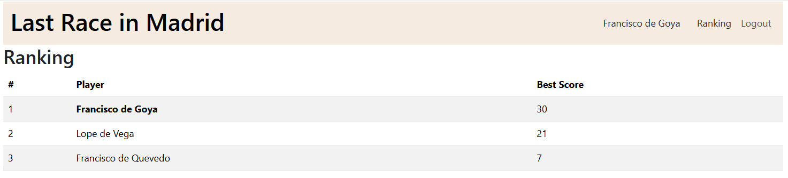
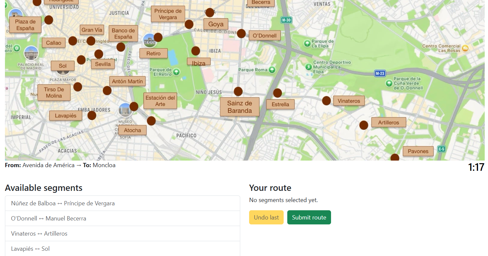

# Exam #1: "Last Race"
## Student: s350727 Tejedor Sofía 

## React Client Application Routes

- Route `/`: Landing page. Shows game instructions. Logged-in users see a "Start playing!" button (navigates to `/game`). Anonymous users see a "Log in to play!" button (navigates to `/login`).
- Route `/login`: Login form with email and password fields. On success, redirects to `/`.
- Route `/logout`: Performs logout on mount and redirects to `/`.
- Route `/game`: Setup phase. Displays the full network map (stations, connections, lines). The "Ready!" button creates a new game and navigates to `/game/planning`.
- Route `/game/planning`: Planning phase. Shows a stations-only map, the assigned start and end stations, a 90-second countdown, and two columns: available segments and the player's built route. Auto-submits when time runs out.
- Route `/game/result`: Execution and result phase. For valid routes, reveals steps one at a time (event + coin effect). For invalid routes, shows the reason. Displays the final score with "Play again" and "See ranking" buttons.
- Route `/ranking`: General ranking table with position, player name, and best score (descending). The current user's row is highlighted in bold.

## API Server

- POST `/api/sessions`: Login
    - Request body: `{ "username": "quevedo@gmail.com", "password": "buscón1626" }`
    - Response body: `{ "id": 1, "name": "Francisco de Quevedo", "email": "quevedo@gmail.com" }` or `401 Unauthorized`
- GET `/api/sessions/current` : Check if still logged in
    - Response body: `{ "id", "name", "email" }` or `401 Unauthorized`
- DELETE `/api/sessions/current` : Logout
    - No response body
- GET `/api/network`: Get the full metro network (auth required)
    - Response body: `{ "lines": [{ "id", "name", "color", "stations": [{ "id", "name" }] }], "stations": [{ "id", "name" }], "segments": [{ "stationA": { "id", "name" }, "stationB": { "id", "name" } }] }`
- POST `/api/games`: Create a new game (auth required)
    - No request body. The server randomly picks start/end stations (minimum 3 segments apart).
    - Response body: `{ "gameId", "startStation": { "id", "name" }, "endStation": { "id", "name" } }` or `503`
- POST `/api/games/:id/route`: Submit a route for the game `:id` (auth required)
    - Request body: `{ "segments": [{ "stationA": 1, "stationB": 2 }, ...] }`. Validated with `express-validator`.
    - The server validates the route (correct start/end, segments exist and connected, no repeats), executes it (random event per segment), and saves the score.
    - Response body: `{ "valid": true, "steps": [{ "from", "to", "event": { "description", "effect" }, "coinsAfter" }], "finalScore" }` or `{ "valid": false, "reason", "steps": [], "finalScore": 0 }`. Also `404` / `403` / `409` / `422` for error cases.
- GET `/api/ranking` : Get the general ranking (auth required)
    - Response body: `[{ "name", "bestScore" }]` sorted by `bestScore DESC`

## Database Tables

- Table `lines`: Metro lines (id, name, color). Contains 5 lines: L1, L2, L3, L6, L9.
- Table `stations`: Metro stations (id, name). Contains 30 stations from the real Madrid Metro network.
- Table `line_stations`: Associates stations to lines with its correspondent order within the line (line_id, station_id, position). Used to derive segments from consecutive positions on the same line.
- Table `events` :Random events that occur during game execution (id, description, effect). Contains 17 events with effects ranging from -4 to +4.
- Table `users`: Registered users (id, name, email, password, salt). Passwords hashed with hashed with https://www.browserling.com/tools/scrypt (output size 32 bytes, N=16384, r=8, p=1) and unique random 16 bytes salts generated with https://randomkeygen.com/salt.
- Table `games`: Game records (id, user_id, start_station_id, end_station_id, score, played_at). 

## Main React Components

- `App` (in `App.jsx`): Root component. Manages user state (`useState`), restores session on mount (`useEffect` + `checkSession`), defines all routes, provides `UserContext.Provider`. Contains `MainLayout` and `LandingPage` as inner components.
- `Header` (in `Header.jsx`): Navbar. Shows "Log In" button for anonymous users, or user name + "Ranking" and "Logout" links for authenticated users.
- `LoginForm` (in `LoginForm.jsx`): Controlled form for login. Displays inline error messages on failure (auto-clears after 3 seconds).
- `Logout` (in `LoginForm.jsx`): Calls `doLogout` on mount and redirects to `/`.
- `SetupPage` (in `SetupPage.jsx`): Displays the full network map image. Creates a new game via `createGame` and navigates to `/game/planning` passing game data in route state.
- `PlanningPage` (in `PlanningPage.jsx`): Fetches the network, manages the 90-second timer, lets the player build a route by clicking segments. Supports undo. Submits the route (manually or on timeout).
- `ResultPage` (in `ResultPage.jsx`): Shows execution steps one at a time with "Next step" button. Displays final score and navigation options.
- `RankingPage` (in `RankingPage.jsx`): Fetches and displays the ranking table. Highlights the current user's row via `UserContext`.

## Screenshot

## Users Credentials

- username: quevedo@gmail.com, password: buscón1626
- username: lope@gmail.com, password: perro1618
- username: goya@gmail.com, password: majadesnuda1800
- username: concha@gmail.com, password: esfinge1914

## Use of AI Tools

- GitHub Copilot was used to aid with comments generations while developing. They were always checked and modified in case it was not meaningful for me.
- Claude was used to understand some concepts such as hooks. The information was contrasted with the course's slides and some external documentation such as https://react.dev/learn/you-might-not-need-an-effect
- Claude was also used whenever I partly finished some module. I send the code and asked for suggestions of improvement. Read it carefully, and in case I initially agreed I checked the slides and in the course's repo. It was all an iterative process.
